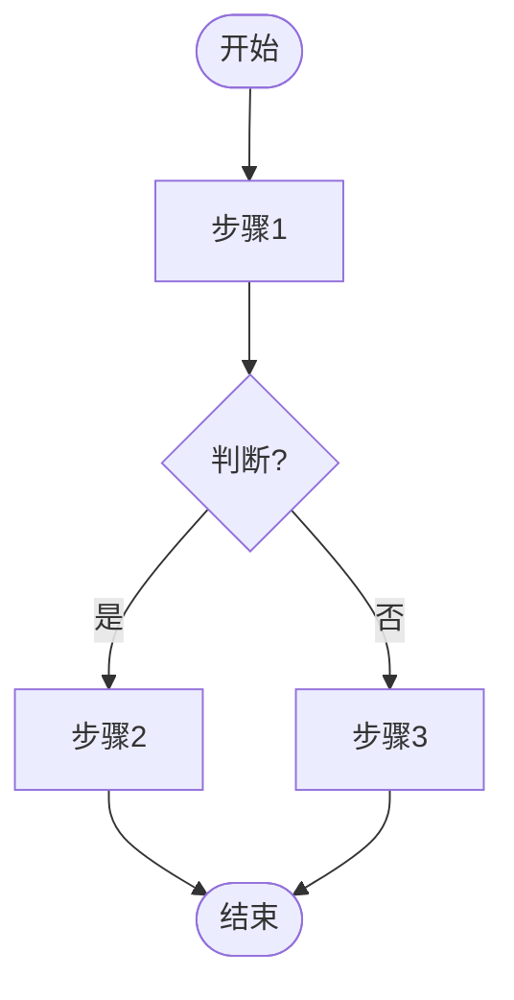
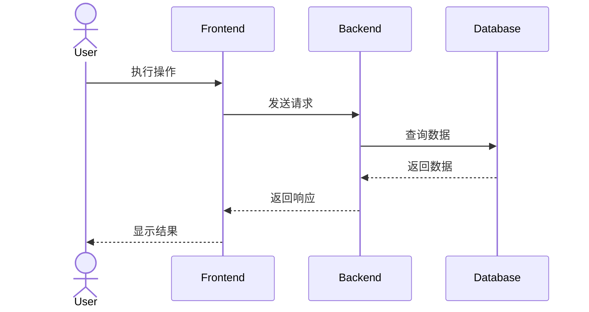
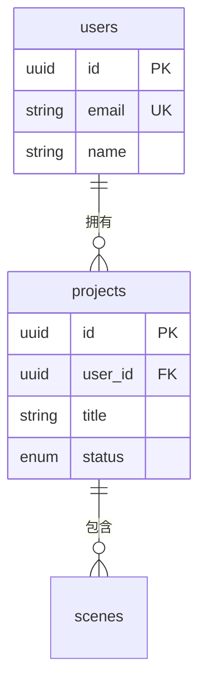
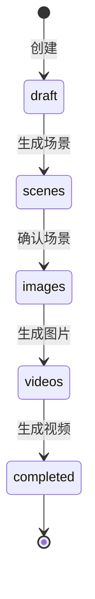

# Mermaid 图表模式库

## 流程图 (Flowchart)

## 时序图 (Sequence)

## ER 图 (Entity Relationship)

## 状态图 (State)

## 节点形状

- [矩形]
- (圆角矩形)
- ([体育场形])
- {菱形}
- ((圆形))

## 箭头类型

- --> 实线箭头
- -.-> 虚线箭头
- ==> 粗箭头

## 图表选择指南

| 需要表达的内容 | 推荐图表 |
|--------------|---------|
| 操作步骤和决策 | Flowchart |
| 组件交互时序 | Sequence |
| 数据实体关系 | ER Diagram |
| 状态流转 | State Diagram |
| 模块结构 | Flowchart (TB) |
