# DocMind 页面流程图

**版本**: v1.0 | **日期**: 2026-04-20

> 本文档包含 DocMind 平台所有核心流程的 Mermaid 图表，可在支持 Mermaid 的 Markdown 编辑器（如 GitHub、VS Code + Mermaid 插件、Typora）中渲染查看。

---

## 1. 页面导航地图

> 展示所有页面之间的跳转关系

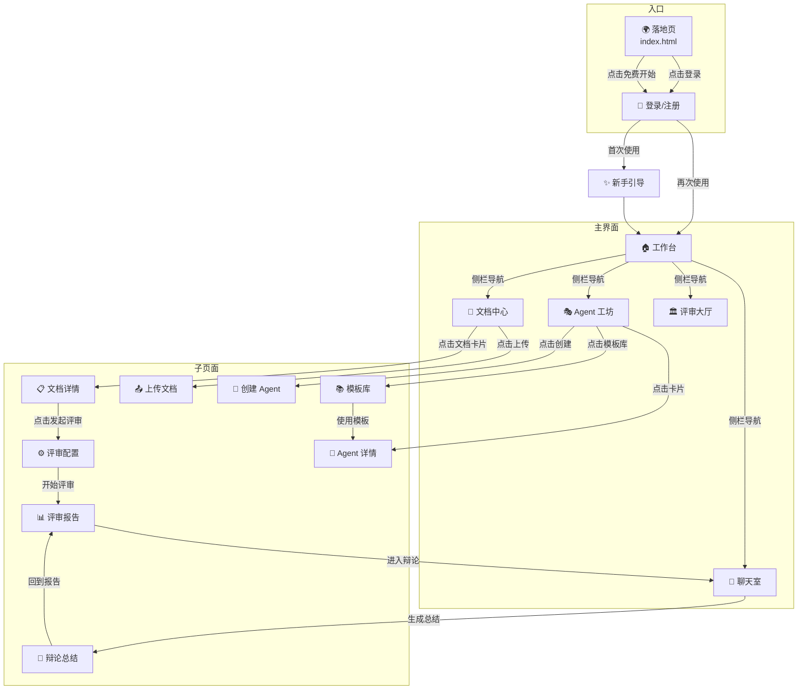

---

## 2. 首次使用（新手引导）流程

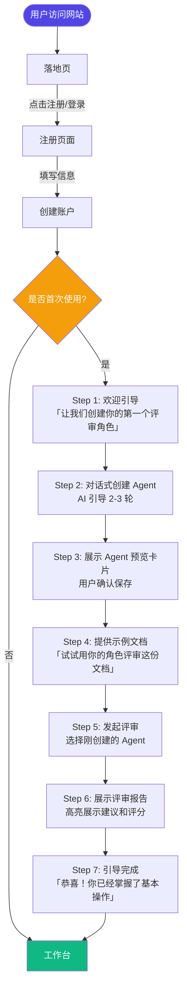

---

## 3. 文档评审核心流程（主线）

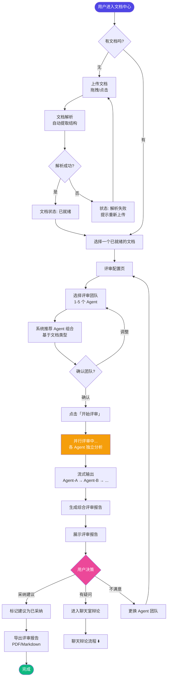

---

## 4. Agent 创建流程

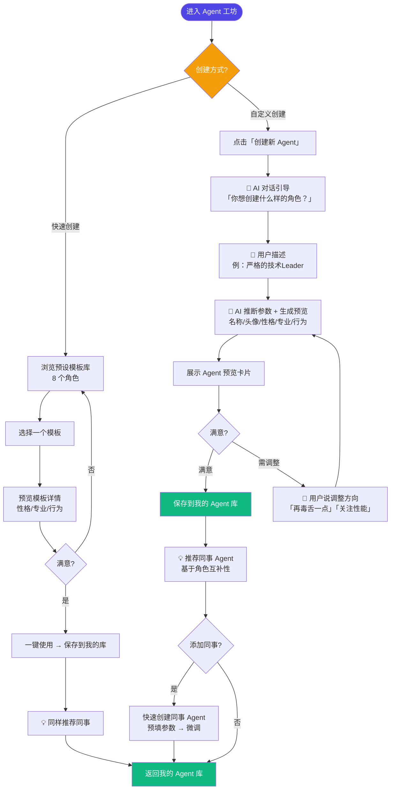

---

## 5. 聊天室辩论流程

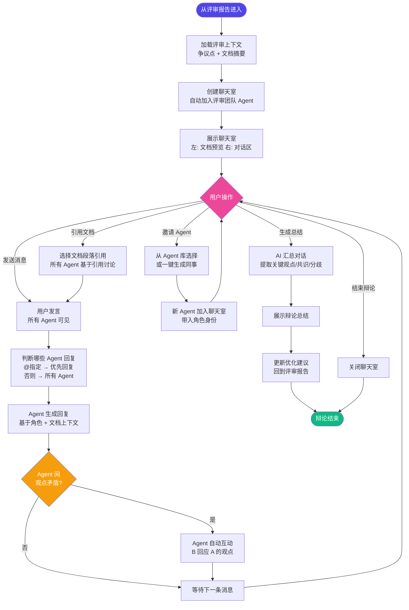

---

## 6. 评审时序图

> 展示评审发起时前后端 + AI 引擎的交互时序

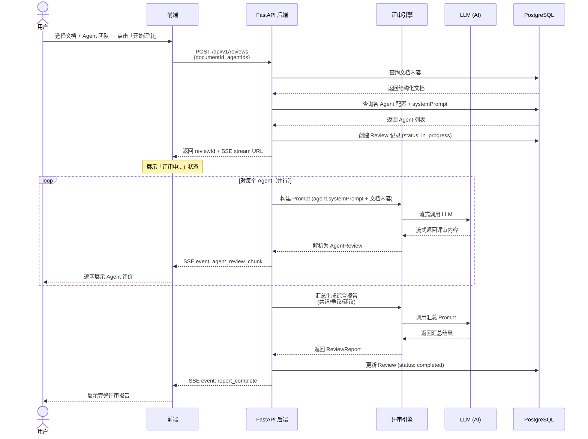

---

## 7. 聊天室时序图

> 展示用户发言后 Agent 间的互动时序

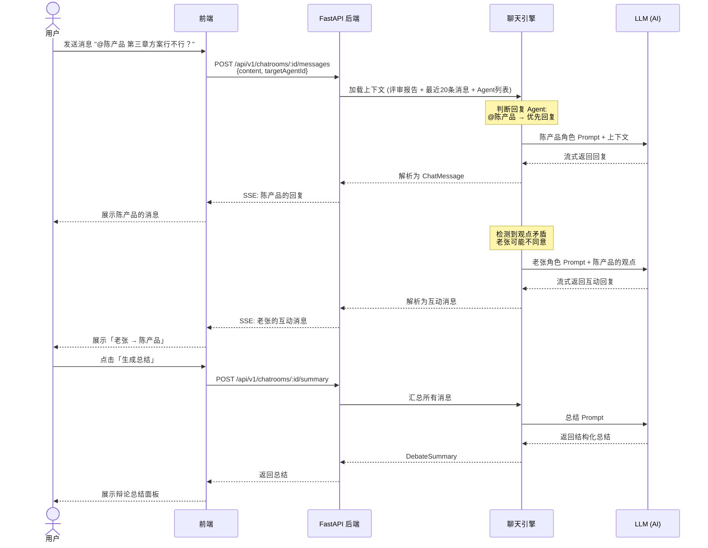

---

## 8. 数据实体 ER 图

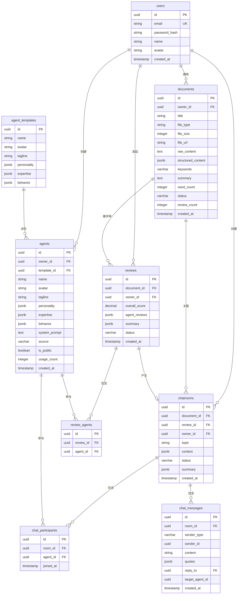

---

## 9. 文档状态图

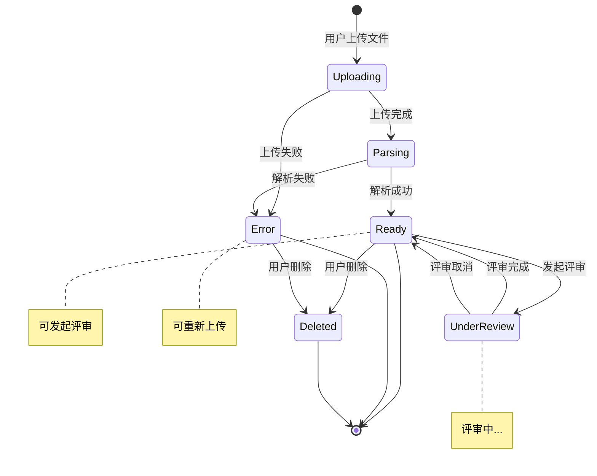

---

## 10. Agent 状态图

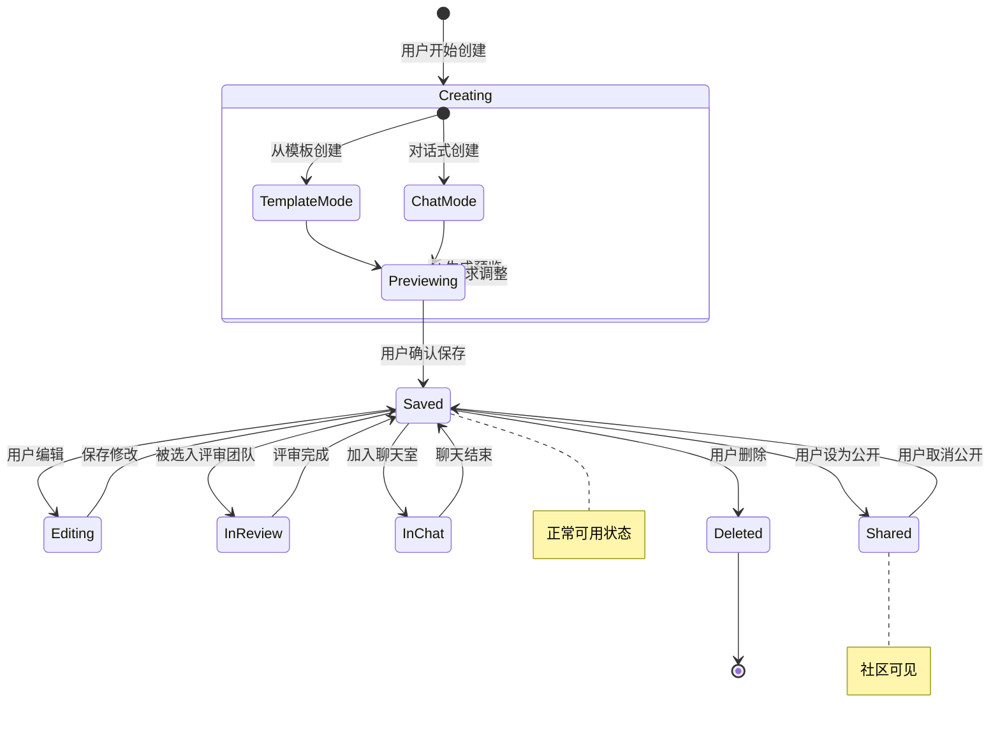

---

## 11. 评审状态图

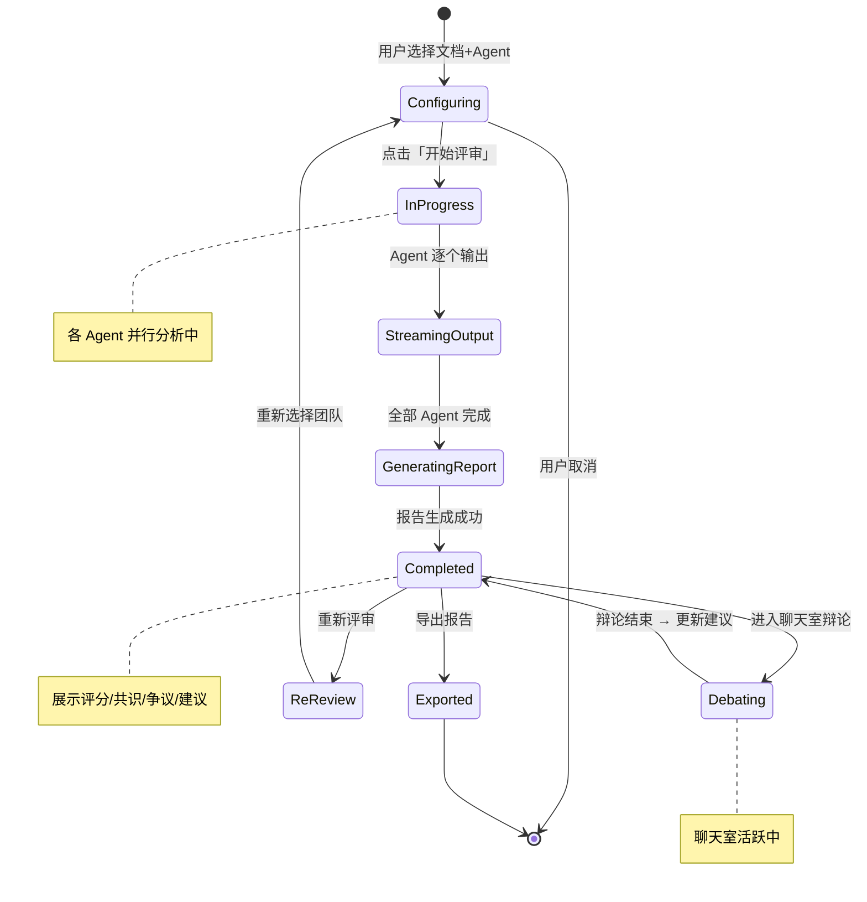

---

## 12. 完整用户旅程图

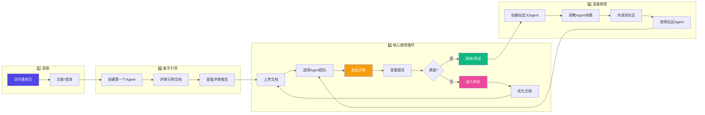

---

> 📎 相关文档：
> - [产品架构](./product-architecture.md)
> - [技术架构](./technical-architecture.md)
> - [PRD-01-概述与功能列表](./PRD-DocMind-01-概述与功能列表.md)
> - [UI 设计规范](./ui-design-spec.md)
