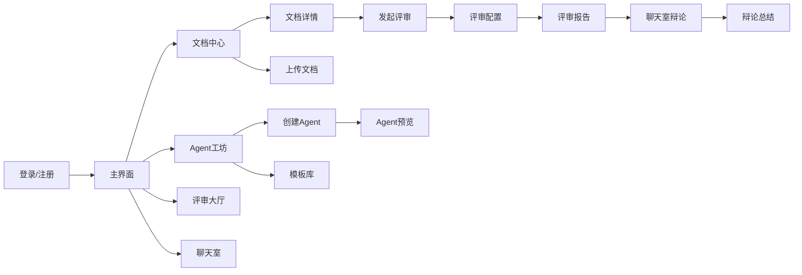

# DocMind UI 设计规范

**版本**: v1.0 | **日期**: 2026-04-20

---

## 1. 设计理念

### 1.1 设计关键词

> **专业 · 温暖 · 清晰 · 有趣**

- **专业**：文档评审是严肃的事情，界面不能太花哨
- **温暖**：AI Agent 是有"性格"的角色，界面要有温度
- **清晰**：评审信息量大，层次必须分明
- **有趣**：多角色辩论是产品灵魂，界面要传达"碰撞感"

### 1.2 核心设计原则

| 原则 | 说明 |
|------|------|
| 信息层次优先 | 评审报告信息密度高，通过视觉层次引导阅读顺序 |
| 角色可识别 | 每个 Agent 有独特的颜色标识和头像，一眼区分 |
| 渐进式展示 | 先给摘要，按需展开详情，避免信息过载 |
| 流式反馈感 | 评审/聊天结果实时流式展示，营造"正在思考"的感觉 |
| 减少打断 | 用户操作连贯，尽量减少弹窗打断 |

---

## 2. 设计令牌（Design Tokens）

### 2.1 色彩系统

#### 主色板

| 名称 | 色值 | 用途 |
|------|------|------|
| **Primary-600** | `#4F46E5` (Indigo) | 主按钮、选中态、链接 |
| **Primary-500** | `#6366F1` | 主色悬停态 |
| **Primary-100** | `#EEF2FF` | 主色浅底、卡片高亮 |
| **Primary-50** | `#F5F3FF` | 页面背景色 |

#### 语义色

| 名称 | 色值 | 用途 |
|------|------|------|
| **Success** | `#10B981` (Emerald) | 采纳建议、通过、共识点 |
| **Warning** | `#F59E0B` (Amber) | 中等优先建议、提示 |
| **Error** | `#EF4444` (Red) | 严重问题、删除确认 |
| **Info** | `#3B82F6` (Blue) | 信息提示、引导 |

#### 中性色

| 名称 | 色值 | 用途 |
|------|------|------|
| **Gray-900** | `#111827` | 主文字 |
| **Gray-700** | `#374151` | 次要文字 |
| **Gray-500** | `#6B7280` | 辅助文字、placeholder |
| **Gray-300** | `#D1D5DB` | 边框、分割线 |
| **Gray-100** | `#F3F4F6` | 背景、表格斑马纹 |
| **White** | `#FFFFFF` | 卡片背景、输入框 |

#### Agent 角色色板（8 色）

| 色值 | 用途 | 对应角色类型 |
|------|------|-------------|
| `#6366F1` Indigo | 学术/教育 | 🎓 李教授 |
| `#8B5CF6` Violet | 技术/工程 | 💻 老张 |
| `#EC4899` Pink | 产品/商业 | 📋 陈产品 |
| `#F97316` Orange | 设计/创意 | 🎨 小林 |
| `#14B8A6` Teal | 新手/学习 | 👨‍🎓 小王 |
| `#0EA5E9` Sky | 管理/决策 | 👔 赵总 |
| `#64748B` Slate | 法务/合规 | ⚖️ 孙律师 |
| `#22C55E` Green | 数据/分析 | 📊 数据刘 |

> **规则**：每个 Agent 卡片左边框、头像光环、消息气泡左边框使用该 Agent 的角色色。用户创建自定义 Agent 时，系统从剩余色池分配或让用户自选。

### 2.2 排版

#### 字体

| 用途 | 字体 | 备选 |
|------|------|------|
| 西文/数字 | Inter | -apple-system, sans-serif |
| 中文正文 | 系统默认 | "PingFang SC", "Microsoft YaHei", sans-serif |
| 代码/等宽 | JetBrains Mono | "Fira Code", monospace |

#### 字号层级

| 级别 | 字号 | 行高 | 字重 | 用途 |
|------|:----:|:----:|:----:|------|
| **H1** | 30px | 36px | 700 | 页面标题 |
| **H2** | 24px | 32px | 600 | 区块标题 |
| **H3** | 20px | 28px | 600 | 卡片标题、Tab 标签 |
| **Body-L** | 16px | 24px | 400 | 主要内容文字 |
| **Body-M** | 14px | 22px | 400 | 辅助说明、列表项 |
| **Caption** | 12px | 18px | 400 | 时间戳、标签、提示 |
| **Score** | 48px | 56px | 700 | 评审大数字评分 |

### 2.3 间距

基于 **4px** 基准网格：

| Token | 值 | 用途 |
|-------|:--:|------|
| **xs** | 4px | 图标与文字间距、紧凑内边距 |
| **sm** | 8px | 紧凑元素间距 |
| **md** | 16px | 标准元素间距、卡片内边距 |
| **lg** | 24px | 区块间距 |
| **xl** | 32px | 模块间距 |
| **2xl** | 48px | 页面区域间距 |

### 2.4 圆角

| Token | 值 | 用途 |
|-------|:--:|------|
| **sm** | 6px | 按钮、小标签 |
| **md** | 8px | 输入框、下拉菜单 |
| **lg** | 12px | 卡片、弹窗 |
| **xl** | 16px | 大面板、Modal |
| **full** | 9999px | 头像、圆形按钮 |

### 2.5 阴影

| Token | 值 | 用途 |
|-------|---|------|
| **sm** | `0 1px 2px rgba(0,0,0,0.05)` | 悬浮按钮 |
| **md** | `0 4px 6px rgba(0,0,0,0.07)` | 卡片 |
| **lg** | `0 10px 15px rgba(0,0,0,0.1)` | 弹窗、Modal |
| **ring** | `0 0 0 3px rgba(99,102,241,0.3)` | 输入框聚焦 |

---

## 3. 布局系统

### 3.1 全局布局

```
┌──────────────────────────────────────────────────┐
│  Header (h-14)                                    │
│  Logo  |  文档中心  Agent工坊  评审大厅  聊天室  | Avatar │
├──────────────────────────────────────────────────┤
│                                                    │
│              Main Content                          │
│              (max-w-7xl mx-auto)                   │
│              左右留白，居中展示                       │
│                                                    │
│                                                    │
│                                                    │
│                                                    │
└──────────────────────────────────────────────────┘
```

| 参数 | 值 |
|------|---|
| 最大内容宽度 | 1280px (max-w-7xl) |
| Header 高度 | 56px (h-14) |
| 侧边留白 | 24px (px-6) |
| 背景色 | Primary-50 (#F5F3FF) |

### 3.2 双栏布局（文档详情 / 评审配置）

```
┌───────────────────────┬─────────────────────────┐
│                       │                         │
│   左栏 (55%)          │    右栏 (45%)           │
│   文档内容浏览         │    评审配置/结果展示      │
│                       │                         │
│   · 文档正文          │    · Agent选择面板       │
│   · 段落导航          │    · 评审报告            │
│   · 原文引用          │    · 对比视图            │
│                       │                         │
└───────────────────────┴─────────────────────────┘
```

### 3.3 聊天室布局

```
┌───────────────────────────┬───────────────────────┐
│                           │                       │
│   文档预览面板 (30%)       │   聊天区域 (70%)       │
│                           │                       │
│   · 文档缩略视图           │   ┌───────────────┐  │
│   · 引用高亮              │   │ 消息区域        │  │
│   · 章节快速跳转           │   │ (可滚动)       │  │
│                           │   └───────────────┘  │
│                           │   ┌───────────────┐  │
│   ┌─────────────────┐    │   │ 参与者栏        │  │
│   │ 在线Agent列表    │    │   │ 🧑‍💻 📋 🎨       │  │
│   │ · 老张 ●        │    │   └───────────────┘  │
│   │ · 陈产品 ●       │    │   ┌───────────────┐  │
│   │ · 小林 ○(离线)   │    │   │ 输入框 + 发送   │  │
│   └─────────────────┘    │   └───────────────┘  │
│                           │                       │
└───────────────────────────┴───────────────────────┘
```

---

## 4. 核心组件设计

### 4.1 文档卡片（DocumentCard）

```
┌──────────────────────────────────┐
│  📄  产品需求文档 v2.0             │
│                                    │
│  PDF · 5,200字 · 3次评审            │
│                                    │
│  ⚪ 解析完成   🕐 2小时前            │
│                                    │
│  ┌────────────────────────────┐  │
│  │  发起评审  │  查看详情  │  ⋮  │  │
│  └────────────────────────────┘  │
└──────────────────────────────────┘

状态标签颜色：
  ⚪ 已就绪 → Success 绿
  🟡 解析中 → Warning 黄 + 旋转动画
  🔴 解析失败 → Error 红
```

### 4.2 Agent 卡片（AgentCard）

```
┌─ Indigo 左边框 ─────────────────────┐
│                                       │
│  ┌─────┐                              │
│  │ 🎓  │  李教授                       │
│  │头像  │  大学教授 · 学术导师           │
│  └─────┘                              │
│                                       │
│  温和严谨 · 注重逻辑与论证              │
│                                       │
│  🏷 学术 🏷 逻辑 🏷 规范               │
│                                       │
│  已使用 12 次                          │
│                                       │
│  [使用此角色]  [编辑]                   │
│                                       │
└───────────────────────────────────────┘
```

设计要点：
- 左边框使用角色色（3px）
- 头像圆形 + 角色色 2px 光环
- Tag 使用角色色浅底

### 4.3 评审报告面板（ReviewReport）

```
┌──────────────────────────────────────────┐
│  📄 《产品需求文档 v2.0》评审报告           │
│                                          │
│  ┌──────────────────────────────┐        │
│  │     综合评分                   │        │
│  │        4.2                    │        │
│  │      ★★★★☆                  │        │
│  └──────────────────────────────┘        │
│                                          │
│  维度评分：                                │
│  结构  ████████░░  4.5                    │
│  逻辑  ████████░░  4.0                    │
│  表达  ███████░░░  3.8                    │
│  可行性 ████████░░ 4.5                    │
│                                          │
│  ─────────────────────────────           │
│                                          │
│  🤝 共识 (2)                              │
│  ┌─ Success 浅绿底 ──────────────────┐   │
│  │ ✓ 文档结构清晰，逻辑主线完整        │   │
│  │ ✓ 第三章数据支撑不够               │   │
│  └───────────────────────────────────┘   │
│                                          │
│  ⚡ 争议 (1)                              │
│  ┌─ Warning 浅黄底 ──────────────────┐   │
│  │ 🧑‍💻 老张: 方案技术上可行            │   │
│  │ 📋 陈产品: ROI太低，用户不买单      │   │
│  │                      [进入辩论 →]  │   │
│  └───────────────────────────────────┘   │
│                                          │
│  💡 优化建议 (5)                          │
│  ┌──────────────────────────────────┐   │
│  │ 1. 🔴 高 补充第三章数据来源   [采纳]│   │
│  │ 2. 🔴 高 增加用户场景描述     [采纳]│   │
│  │ 3. 🟡 中 简化技术方案描述     [采纳]│   │
│  │ 4. 🟡 中 补充风险评估         [采纳]│   │
│  │ 5. 🟢 低 优化摘要表达         [采纳]│   │
│  └──────────────────────────────────┘   │
│                                          │
│  [导出报告]  [重新评审]                    │
└──────────────────────────────────────────┘
```

### 4.4 聊天气泡（ChatBubble）

```
用户消息（右对齐，灰色气泡）：
                              ┌──────────────────────┐
                              │ 第三章方案到底行不行？  │
                              └──────────────────────┘

Agent 消息（左对齐，角色色左边框）：
  ┌─ Indigo ─┐
  │ 🎓 李教授  │  2分钟前
  └──────────┘
  ┌────────────────────────────────────────┐
  │ 从学术角度来看，第三章的论证框架是       │
  │ 完整的，但引用的数据源需要补充。         │
  │                                        │
  │ 📄 引用："第三章第二节，表3-2"          │
  └────────────────────────────────────────┘

Agent 间互动消息（缩进显示，带箭头）：
    🧑‍💻 老张 → 📋 陈产品:
    ┌──────────────────────────────────────┐
    │ 但如果优化交互，用户价值是可以实现的。   │
    └──────────────────────────────────────┘
```

### 4.5 上传区域（UploadZone）

```
默认态：
┌──────────────────────────────────────┐
│                                        │
│          ☁️                             │
│     拖拽文件到这里                       │
│     或点击上传                          │
│                                        │
│  支持 PDF / Word / Markdown / TXT       │
│  最大 20MB                              │
│                                        │
└──────────────────────────────────────┘

拖拽悬浮态：虚线边框变为 Primary 色 + 浅底

上传中：
┌──────────────────────────────────────┐
│  📄 产品需求文档 v2.0.pdf               │
│  ████████████░░░░░░  68%              │
│  正在上传...                           │
└──────────────────────────────────────┘
```

### 4.6 Agent 创建面板（AgentCreator）

```
┌──────────────────────────────────────────┐
│  🎭 创建新的评审角色                       │
│                                          │
│  ┌─── 对话区域 ───────────────────────┐  │
│  │                                    │  │
│  │  🤖 AI: 你想创建什么样的评审角色？   │  │
│  │      可以简单描述一下               │  │
│  │                                    │  │
│  │              👤 用户: 一个严格的     │  │
│  │              技术Leader，注重代码    │  │
│  │              规范，说话比较直接       │  │
│  │                                    │  │
│  │  🤖 AI: 好的，我帮你生成了这个角色 ↓ │  │
│  │                                    │  │
│  └────────────────────────────────────┘  │
│                                          │
│  ┌─── Agent 预览卡片 ──────────────────┐  │
│  │  ┌────┐                              │  │
│  │  │ 💻 │  老张                        │  │
│  │  └────┘  毒舌但专业的技术Leader       │  │
│  │                                    │  │
│  │  性格: 直接 · 严格度 4/5             │  │
│  │  领域: 技术 · 架构                   │  │
│  │  口头禅: "这代码写得...我看看"        │  │
│  └────────────────────────────────────┘  │
│                                          │
│  [继续调整]          [✓ 保存这个角色]      │
│                                          │
│  💡 推荐同事：                            │
│  ┌──────────┐  ┌──────────┐              │
│  │ 📋 陈产品  │  │ 🎨 小林   │              │
│  │ 产品经理   │  │ UX设计师  │              │
│  │ [+ 添加]  │  │ [+ 添加]  │              │
│  └──────────┘  └──────────┘              │
└──────────────────────────────────────────┘
```

---

## 5. 交互规范

### 5.1 动效规范

| 场景 | 动效 | 时长 | 曲线 |
|------|------|:----:|------|
| 页面切换 | 淡入 + 微上移 | 200ms | ease-out |
| 卡片悬停 | 上移 2px + 阴影加深 | 150ms | ease |
| 下拉展开 | 高度动画 | 200ms | ease-in-out |
| 评审流式输出 | 逐字出现 | - | - |
| Agent 正在思考 | 头像下方三点跳动 | 循环 | - |
| 评分条动画 | 从 0 填充到目标值 | 600ms | ease-out |
| 建议采纳 | 划线 + 淡化 | 300ms | ease |
| Toast 提示 | 从右侧滑入 | 300ms | ease-out |
| Modal 弹出 | 背景渐暗 + 内容缩放 | 200ms | ease-out |

### 5.2 加载状态

| 场景 | 展示方式 |
|------|---------|
| 文档解析中 | 骨架屏 (Skeleton) |
| 评审进行中 | 进度条 + 各 Agent 头像下方显示"思考中..." |
| 聊天 Agent 回复中 | 输入框上方显示 `●●●` 跳动动画 |
| 列表加载 | Spinner 居中 |
| 页面首次加载 | 全页骨架屏 |

### 5.3 空状态

| 场景 | 展示 |
|------|------|
| 无文档 | 插画 + "上传第一份文档，开始你的多角色评审之旅" + [上传文档] 按钮 |
| 无 Agent | 插画 + "创建你的第一个评审角色" + [创建Agent] 按钮 |
| 无评审记录 | "还没有评审过这份文档" + [发起评审] 按钮 |
| 无聊天记录 | 聊天室刚创建时的欢迎语 |

### 5.4 操作反馈

| 操作 | 反馈 |
|------|------|
| 上传成功 | Toast: "文档上传成功，正在解析..." |
| 评审完成 | 通知铃铛 + 报告面板自动展开 |
| Agent 保存 | Toast: "角色已保存" + 卡片飞入列表动画 |
| 建议采纳 | 按钮变为 ✓ 已采纳 + 文字划线 |
| 删除确认 | Modal 二次确认：确定删除"xxx"？此操作不可撤销 |
| 错误提示 | 页面顶部红色 Banner，5 秒自动消失 |

---

## 6. 关键页面线框

### 6.1 页面地图



### 6.2 文档中心页面

```
┌──────────────────────────────────────────────────┐
│  Header: Logo | 文档中心 Agent工坊 评审大厅 聊天室  |  Avatar │
├──────────────────────────────────────────────────┤
│                                                    │
│  📄 文档中心                    [🔍 搜索] [+ 上传]  │
│                                                    │
│  ┌──────┐  ┌──────┐  ┌──────┐  ┌──────┐          │
│  │ Doc1 │  │ Doc2 │  │ Doc3 │  │ Doc4 │          │
│  │      │  │      │  │      │  │      │          │
│  │ PDF  │  │ MD   │  │ DOCX │  │ PDF  │          │
│  │ 5200 │  │ 3200 │  │ 8100 │  │ 1500 │          │
│  │ 3审  │  │ 1审  │  │ 0审  │  │ 5审  │          │
│  └──────┘  └──────┘  └──────┘  └──────┘          │
│                                                    │
│  ┌──────┐  ┌──────┐  ┌──────┐                    │
│  │ Doc5 │  │ Doc6 │  │ Doc7 │                    │
│  │      │  │      │  │      │                    │
│  │ ...  │  │ ...  │  │ ...  │                    │
│  └──────┘  └──────┘  └──────┘                    │
│                                                    │
│  [加载更多...]                                      │
│                                                    │
└──────────────────────────────────────────────────┘
```

### 6.3 评审报告页面

```
┌──────────────────────────────────────────────────┐
│  Header                                           │
├───────────────────────┬──────────────────────────┤
│                       │                          │
│  📄 文档内容            │  📊 评审报告              │
│  (只读浏览)            │                          │
│                       │  ┌─ 综合评分卡片 ─────┐   │
│  ┌─ 章节导航 ───────┐ │  │       4.2          │   │
│  │ ▸ 摘要           │ │  │    ★★★★☆         │   │
│  │ ▸ 第一章 背景     │ │  │   3位Agent评审     │   │
│  │ ▸ 第二章 方案     │ │  └────────────────┘   │
│  │ ▸ 第三章 细节     │ │                          │
│  │ ▸ 第四章 总结     │ │  ┌─ Agent 观点 ──────┐   │
│  └─────────────────┘ │  │ 🧑‍💻 老张 4.0       │   │
│                       │  │   "代码写得还行..."  │   │
│  ┌─ 正文区域 ───────┐ │  │                    │   │
│  │                   │ │  │ 📋 陈产品 3.8      │   │
│  │ 第三章 技术细节    │ │  │   "ROI需要论证..."  │   │
│  │                   │ │  │                    │   │
│  │ 本方案采用微服务   │ │  │ 🎨 小林 4.8        │   │
│  │ 架构，核心模块包括 │ │  │   "交互设计不错..." │   │
│  │ ...               │ │  └────────────────┘   │
│  │                   │ │                          │
│  │ [被引用段落高亮]   │ │  ┌─ 建议列表 ────────┐   │
│  │                   │ │  │ 1.🔴 高 补充数据    │   │
│  └─────────────────┘ │  │ 2.🔴 高 增加场景     │   │
│                       │  │ 3.🟡 中 简化描述    │   │
│                       │  └────────────────┘   │
│                       │                          │
│                       │  [进入辩论] [导出报告]    │
│                       │                          │
└───────────────────────┴──────────────────────────┘
```

---

## 7. 响应式断点

| 断点 | 宽度 | 布局调整 |
|------|------|---------|
| **Desktop** | ≥ 1280px | 标准双栏/三栏布局 |
| **Tablet** | 768-1279px | 双栏缩为单栏，聊天室文档面板折叠为 Tab |
| **Mobile** | < 768px | v1.0 不做专项适配，仅保证不溢出 |

> MVP 阶段专注 Desktop，Tablet 基本可用即可。

---

## 8. 暗色模式（v1.0 之后）

预留暗色模式令牌，但 MVP 不实现：

| Token | Light | Dark |
|-------|-------|------|
| bg-page | `#F5F3FF` | `#0F172A` |
| bg-card | `#FFFFFF` | `#1E293B` |
| text-primary | `#111827` | `#F1F5F9` |
| text-secondary | `#6B7280` | `#94A3B8` |
| border | `#D1D5DB` | `#334155` |

---

## 9. 组件清单

### 9.1 基础组件（基于 shadcn/ui）

| 组件 | 用途 |
|------|------|
| Button | 主按钮、次按钮、幽灵按钮、危险按钮 |
| Input | 文本输入、搜索框 |
| Textarea | 聊天输入框 |
| Select | 下拉选择 |
| Badge | Agent 标签、状态标签 |
| Avatar | 用户头像、Agent 头像 |
| Card | 文档卡片、Agent 卡片 |
| Dialog | 弹窗确认 |
| Tabs | 页面内 Tab 切换 |
| Toast | 操作反馈提示 |
| Progress | 上传进度、评分条 |
| Skeleton | 加载骨架屏 |
| ScrollArea | 聊天消息滚动区域 |
| Tooltip | 悬浮提示 |

### 9.2 业务组件（需自建）

| 组件 | 用途 |
|------|------|
| DocumentCard | 文档卡片（含状态、评审次数） |
| AgentCard | Agent 角色卡片（含角色色、标签） |
| AgentCreator | 对话式创建 Agent 面板 |
| ReviewReport | 评审报告完整面板 |
| ScoreBar | 维度评分进度条 |
| ChatBubble | 聊天气泡（区分用户/Agent/互动） |
| ChatInput | 聊天输入框（支持 @提及、引用） |
| UploadZone | 文件拖拽上传区域 |
| AgentSelector | Agent 多选面板 |
| DebateSummary | 辩论总结面板 |
| SuggestionItem | 优化建议条目（含采纳按钮） |
| ControversyCard | 争议点卡片（展示多方观点） |

---

> 📎 相关文档：
> - [技术架构](./technical-architecture.md)
> - [产品架构](./product-architecture.md)
> - [PRD-01-概述与功能列表](./PRD-DocMind-01-概述与功能列表.md)
